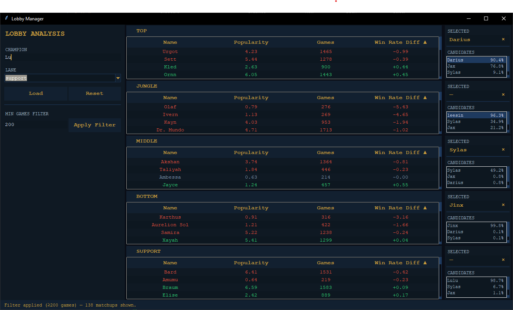

# League of Legends Real-Time Lobby Analysis
<center></center>

A Python based data-driven tool that collects and processes champion statistics from [LoLalytics](https://lolalytics.com), then queries the resulting datasets in real time during champion select to provide assistance in selecting optimal choices based on actions of the opposite players.

## Pipeline

**Stage 1 Data Collection**

**1. Install dependencies**
```bash
pip install -r requirements.txt
```

**2. Configure** (optional)

Open `config.py` to tune data collection parameters - tier bracket, minimum sample size, pick rate thresholds. Tighter filters may reduce noise by dropping matchups with insufficient game volume, at the cost of excluding more niche information.

**3. Run the collector**
```bash
python -m scraper [workers]
```

Crawls LoLalytics across every champion and role combination, extracting and caching relevant information such as per-matchup win rates, game counts, and pick rates into local JSON datasets. The *optional* `workers` parameter controls the number of parallel browser instances - scale up to reduce collection time at the cost of higher resource consumption. Defaults to 1.

---

**Stage 2 Live Draft Analysis**

**4. Start the lobby analysis engine**
```bash
python -m lobby
```

**5. Real-time champion filtering and matchup aggregation**

The application automatically monitors the League Client via WebSocket, capturing bans and champion locks in real-time as they occur during draft. Important information are fed to other layers of the system.  

- **Dynamically filters** the loaded dataset to exclude banned and locked champions (reducing noise from unavailable picks)
- **Aggregates win rate statistics** across all locked enemy champions, computing weighted matchup advantages for remaining available picks
- **Ranks candidates by predicted success**, sorting by aggregated win rate differential to surface the highest-EV picks given the current enemy composition